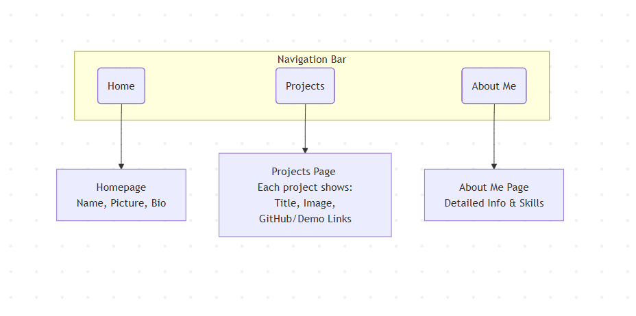

Portfolio Project

by Ayoub Jalyta

---

 
**Client:** Adnan Kesksu  

 F1. Affichage Responsive  
 F2. Contenu Statique  
 F3. Contact Par Email  
 F4. Navigation Simple  

---

Exemple de l'existant

  
  

  

---

Diagramme de cas d'utilisation

  

---

Conception

  

